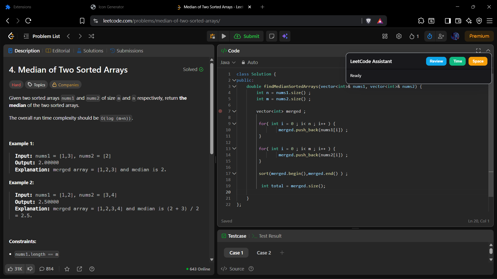
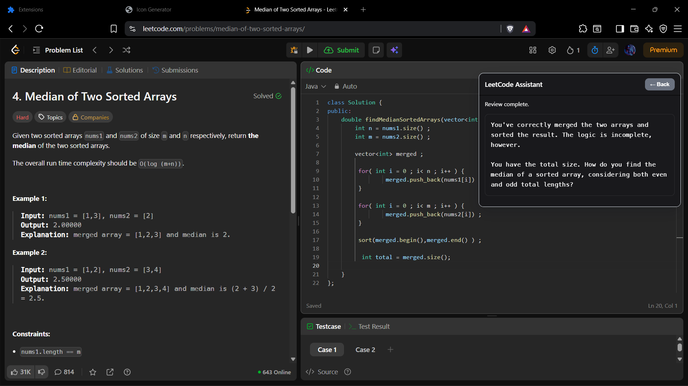
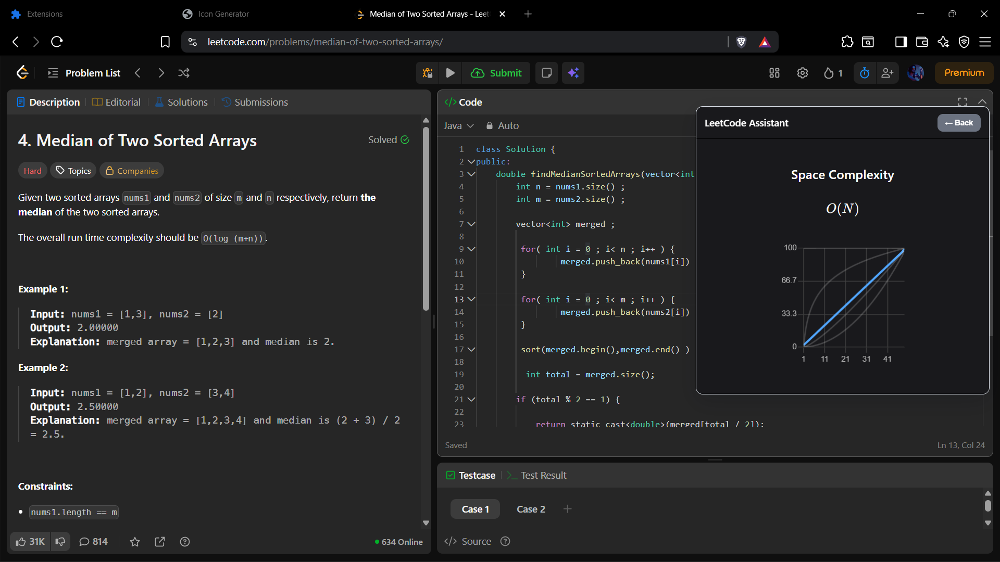
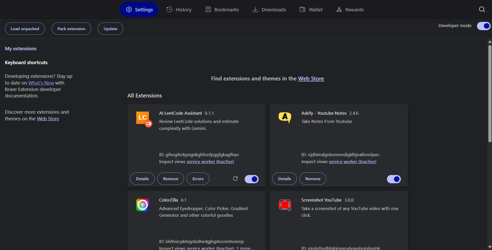

# 🚀 LeetCode AI Assistant

> A powerful Chrome/Brave extension that provides **AI-powered code review** and **complexity analysis** for LeetCode problems using Google's Gemini API.

---

## ✨ Features

- 🤖 **AI Code Review** - Get intelligent feedback and hints on your LeetCode solutions
- 📊 **Time & Space Complexity Analysis** - Beautiful visual graphs with Big-O notation
- 🎨 **Dark UI** - Seamless integration with LeetCode's interface
- ⌨️ **Keyboard Shortcut** - Toggle panel with `Ctrl + \``
- 🚀 **Powered by Gemini 2.5 Pro** - Advanced AI analysis
- 🔒 **Privacy First** - Your code is only sent to Gemini API, nothing stored

---

## 📸 Screenshots

### Main Panel

*The floating assistant panel with Review, Time, and Space buttons*

### AI Code Review

*AI-powered code review with hints and suggestions*

### Time Complexity Graph

*Interactive time complexity visualization*

### Space Complexity Graph

*Interactive space complexity visualization*

---

## 🚀 Quick Start

### Prerequisites

- Node.js (v16 or higher)
- Chrome or Brave browser
- Google Gemini API key ([Get one here](https://aistudio.google.com/app/apikey))

### 1️⃣ Clone the Repository

```bash
git clone https://github.com/yourusername/leetcode-ai-assistant.git
cd leetcode-ai-assistant
```

### 2️⃣ Install Dependencies

```bash
# Install root dependencies
npm install

# Install server dependencies
cd server
npm install
cd ..
```

### 3️⃣ Configure API Key

Create/edit `server/.env` file:

```env
PORT=5055
GEMINI_API_KEY=your_gemini_api_key_here
GEMINI_MODEL=gemini-2.5-pro
```

> 💡 **Get your API key:** Visit [Google AI Studio](https://aistudio.google.com/app/apikey)

### 4️⃣ Start the Application

```bash
npm start
```

This command will:
1. ✅ Build the React visualization component
2. ✅ Copy build files to `server/public`
3. ✅ Start the Express server on `http://localhost:5055`

You should see:
```
Server listening on http://localhost:5055
[INFO] Using Gemini model: gemini-2.5-pro
```

### 5️⃣ Load Extension in Browser

1. Open your browser and navigate to:
   - **Chrome:** `chrome://extensions`
   - **Brave:** `brave://extensions`

2. Enable **Developer mode** (toggle in top-right corner)

3. Click **"Load unpacked"**

4. Select the `extension` folder from this project

5. You should see the extension installed! 🎉



### 6️⃣ Use on LeetCode

1. Go to any [LeetCode problem](https://leetcode.com/problems/)
2. Write your solution in the code editor
3. The assistant panel will appear in the top-right corner
4. Click buttons to analyze your code!

---

## 📖 Usage Guide

### Panel Controls

The extension adds a floating panel to LeetCode with three main buttons:

| Button | Function | Description |
|--------|----------|-------------|
| **Review** | AI Code Review | Get hints, suggestions, and guidance on your solution |
| **Time** | Time Complexity | Visualize time complexity with interactive graph |
| **Space** | Space Complexity | Visualize space complexity with interactive graph |

### Keyboard Shortcuts

- **`Ctrl + \``** - Toggle panel visibility (show/hide)

### Workflow Example

1. **Write your solution** in LeetCode's editor
2. **Click "Review"** to get AI feedback
3. **Click "Time"** to see time complexity analysis
4. **Press `Ctrl + \``** to hide panel while coding
5. **Press `Ctrl + \``** again to show panel

---

## 🏗️ Project Structure

```
leetcode-ai-assistant/
├── extension/              # Chrome Extension
│   ├── manifest.json      # Extension configuration (Manifest V3)
│   ├── content.js         # Main content script (injected into LeetCode)
│   ├── pageBridge.js      # Bridge for code extraction
│   └── icon/              # Extension icons
│
├── server/                # Express Backend
│   ├── src/
│   │   └── index.js       # API server + static file serving
│   ├── .env               # Environment variables (API keys)
│   ├── package.json       # Server dependencies
│   └── public/            # Built React app (auto-generated)
│
├── src/                   # React Visualization App
│   ├── Components/
│   │   ├── ComplexityGraph.jsx  # Main graph component
│   │   ├── Input.jsx            # Input component
│   │   └── Output.jsx           # Output component
│   └── App.jsx            # React root
│
├── package.json           # Root dependencies
├── vite.config.js         # Vite build configuration
└── README.md              # This file
```

---

## 🔧 Implementation Details

### Architecture Overview

```
┌─────────────────┐
│   LeetCode      │
│   Website       │
└────────┬────────┘
         │
         │ (Content Script Injection)
         │
┌────────▼────────┐
│   Extension     │
│   content.js    │◄─── Ctrl+` keyboard listener
└────────┬────────┘
         │
         │ (HTTP Requests)
         │
┌────────▼────────┐
│  Express Server │
│  localhost:5055 │
└────────┬────────┘
         │
         │ (API Calls)
         │
┌────────▼────────┐
│  Gemini API     │
│  (Google AI)    │
└─────────────────┘
```

### Key Components

#### 1. **Content Script** (`extension/content.js`)
- Injects floating panel into LeetCode pages
- Captures code from editor using message passing
- Handles button clicks and keyboard shortcuts
- Manages panel visibility state

#### 2. **Backend Server** (`server/src/index.js`)
- **Endpoints:**
  - `POST /api/review` - AI code review
  - `POST /api/complexity` - Complexity analysis
  - `GET /health` - Health check
- **Features:**
  - CORS enabled for cross-origin requests
  - Serves React app as static files
  - Gemini API integration

#### 3. **React Visualization** (`src/Components/ComplexityGraph.jsx`)
- Interactive complexity graphs using Chart.js
- LaTeX rendering for Big-O notation using KaTeX
- Styled with TailwindCSS
- Embedded in iframe within extension panel

### API Endpoints

#### `POST /api/review`
**Request:**
```json
{
  "code": "class Solution:\n    def twoSum(self, nums, target):\n        ...",
  "language": "python3"
}
```

**Response:**
```json
{
  "review": "Your approach is correct! Here are some hints:\n- Consider edge cases...\n- Time complexity can be improved..."
}
```

#### `POST /api/complexity`
**Request:**
```json
{
  "code": "class Solution:\n    def twoSum(self, nums, target):\n        ...",
  "language": "python3"
}
```

**Response:**
```json
{
  "summary": "Your solution uses a nested loop approach...",
  "complexity": {
    "time": "O(n²)",
    "space": "O(1)",
    "explanation": "Two nested loops iterate through the array..."
  }
}
```

---

## 🛠️ Development

### Development Mode (Hot Reload)

For faster development with hot module replacement:

**Terminal 1 - React Dev Server:**
```bash
npm run dev
```
This starts Vite dev server on `http://localhost:5173`

**Terminal 2 - Backend Server:**
```bash
cd server
npm run dev
```
This starts Express with nodemon on `http://localhost:5055`

**Note:** Update `extension/content.js` line 315 to point to dev server:
```javascript
iframe.src = 'http://localhost:5173'; // Dev mode
```

### Production Build

```bash
npm run build
```

Builds React app to `server/public/` for production deployment.

### Debugging

**Extension Console:**
- Right-click extension icon → "Inspect popup"
- Check console for logs prefixed with `[LC Assistant]`

**Content Script Console:**
- Open DevTools on LeetCode page
- Check console for extension logs

**Server Logs:**
- Check terminal where `npm start` is running
- Look for Gemini API errors or CORS issues

---

## 🎨 Tech Stack

### Frontend
- **React 19** - UI framework
- **Chart.js** - Graph visualization
- **KaTeX** - LaTeX math rendering
- **TailwindCSS** - Styling
- **Vite** - Build tool

### Backend
- **Express.js** - Web server
- **Node.js** - Runtime
- **node-fetch** - HTTP client
- **dotenv** - Environment variables
- **cors** - Cross-origin resource sharing

### AI & APIs
- **Google Gemini 2.5 Pro** - AI model
- **Generative Language API** - Gemini REST API

### Browser Extension
- **Manifest V3** - Chrome Extension format
- **Content Scripts** - DOM injection
- **Shadow DOM** - Style isolation

---

## 🔒 Privacy & Security

- ✅ **No data storage** - Code is only sent to Gemini API
- ✅ **API key in .env** - Never hardcoded or exposed
- ✅ **Local server** - Runs on your machine
- ✅ **HTTPS to Gemini** - Encrypted API communication
- ✅ **No tracking** - No analytics or telemetry

---

## 🐛 Troubleshooting

### "Failed to fetch" Error

**Problem:** Extension shows "Review failed. See console."

**Solutions:**
1. Make sure server is running: `npm start`
2. Check server is on port 5055: `http://localhost:5055/health`
3. Verify `.env` file exists in `server/` folder
4. Check browser console for CORS errors

### Extension Not Appearing

**Problem:** Panel doesn't show on LeetCode

**Solutions:**
1. Reload extension in `chrome://extensions`
2. Hard refresh LeetCode page (`Ctrl + Shift + R`)
3. Check extension is enabled
4. Open console and look for `[LC Assistant]` logs

### Gemini API Errors

**Problem:** "Gemini review failed" or HTTP 400/403

**Solutions:**
1. Verify API key is correct in `server/.env`
2. Check API key has Gemini API enabled
3. Verify you haven't exceeded quota
4. Try different model: `gemini-1.5-flash`

### Panel Blocking Code

**Problem:** Panel covers code editor

**Solution:**
- Press **`Ctrl + \``** to hide/show panel
- Panel is toggleable anytime!

---

## 🤝 Contributing

Contributions are welcome! Please feel free to submit a Pull Request.

1. Fork the repository
2. Create your feature branch (`git checkout -b feature/AmazingFeature`)
3. Commit your changes (`git commit -m 'Add some AmazingFeature'`)
4. Push to the branch (`git push origin feature/AmazingFeature`)
5. Open a Pull Request

---

## 📝 License

This project is licensed under the MIT License - see the [LICENSE](LICENSE) file for details.

---

## 🙏 Acknowledgments

- [LeetCode](https://leetcode.com/) - For the amazing platform
- [Google Gemini](https://ai.google.dev/) - For the powerful AI API
- [Chart.js](https://www.chartjs.org/) - For beautiful graphs
- [KaTeX](https://katex.org/) - For LaTeX rendering

---

## 📧 Contact

Have questions or suggestions? Feel free to open an issue!

**Made with ❤️ for the LeetCode community**
